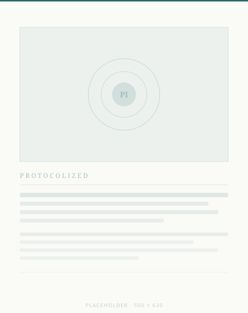
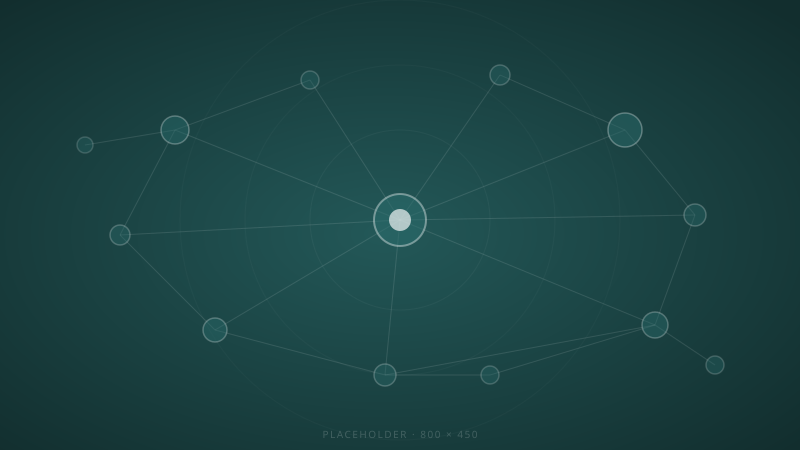

<!-- slide: cover -->

# New Nature: Introducing the Protocol Institute

May 28, 2026

<!-- slide: quote -->

> "Civilization advances by the number of operations we can do without thinking about them."

— Alfred North Whitehead

<!-- slide: section -->

# Part I: The Protocol Age

<!-- slide: big-point -->

# Every coordination breakthrough in history has been a protocol breakthrough.

<!-- slide: bullets -->

## What Is a Protocol?

- A shared rule that enables coordination without requiring central control
- Older than the internet: currencies, languages, and markets are all protocols
- Most protocols are invisible until they break or need redesign
- The protocol layer is now the primary site of institutional innovation

<!-- slide: numbered -->

## How Protocol Institute Works

1. **Research** — Foundational theory: what protocols are, how they evolve, how they fail
2. **Publish** — Original analysis through *Protocolized*, our open-access magazine
3. **Build** — Tools like C3PO that make protocol research accessible to practitioners
4. **Convene** — Annual symposia and a global network of protocol researchers and designers

<!-- slide: section -->

# Part II: Our Work

<!-- slide: table -->

## Programs at a Glance

| Program | Type | Stage | Access |
|---------|------|-------|--------|
| Protocolized | Research Magazine | Live | Open |
| C3PO | AI Research Assistant | Live · Beta | Members |
| Protocol Symposium 2026 | Annual Convening | Upcoming | Registration |
| Protocol Research Network | Community | Building | Invite |

<!-- slide: two-column -->

## Protocolized: Our Magazine

- Published since 2023, building on the Summer of Protocols research sprint
- Long-form analysis of protocols in technology, governance, and culture
- Open-access archive with 100+ essays and research papers
- 4,000+ subscribers: researchers, practitioners, and policy-makers

<!-- split -->

*Protocolized — open-access protocol research and analysis*

<!-- slide: big-image -->

*A growing network of researchers, practitioners, and institutions studying the infrastructure of coordination*

<!-- slide: cover -->

# Contact

**Timber Stinson-Schroff**, Managing Director timber@protocol-institute.org

**Venkatesh Rao**, Director of Research venkat@protocol-institute.org
